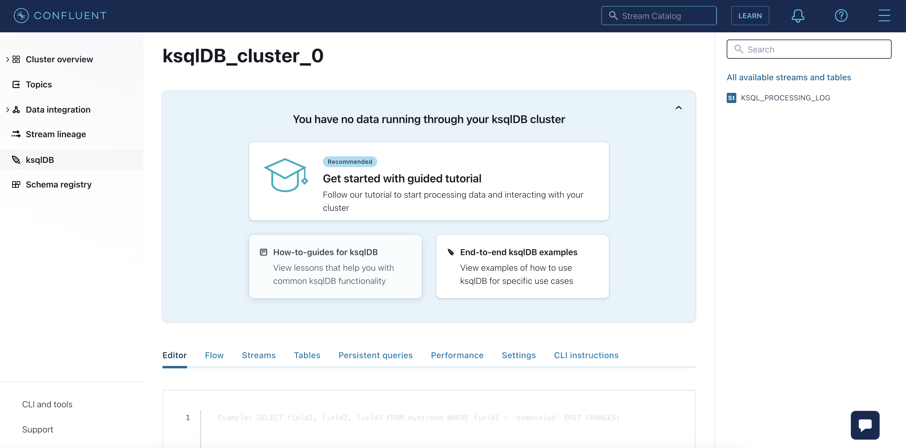

# Internet of Things Use Case: Temperature Alerting System (Confluent Cloud)

We are going to build data pipeline which should look like this:


## 1. Confluent cloud ksqldb setup

- Login to Confluent Cloud.
- Select environment "ksqldb-workshop"
- Create new cluster or select an existing one.
- From the left panel select "ksqlDB" to display all apps.
- Select your ksqlDB cluster to display the ksqlDB Editor.



Check the properties set for the ksqlDB cluster:

```
show properties;
```

## 2. Create Stream (TEMPERATURE_READINGS)

```
CREATE STREAM TEMPERATURE_READINGS (ID VARCHAR KEY, TIMESTAMP VARCHAR, READING BIGINT)
    WITH (KAFKA_TOPIC = 'TEMPERATURE_READINGS',
          VALUE_FORMAT = 'JSON',
          TIMESTAMP = 'TIMESTAMP',
          TIMESTAMP_FORMAT = 'yyyy-MM-dd HH:mm:ss',
          PARTITIONS = 1);
```

Check your creation with describe.

```
describe TEMPERATURE_READINGS;
```

Insert some data in created stream

```
INSERT INTO TEMPERATURE_READINGS (ID, TIMESTAMP, READING) VALUES ('1', '2020-01-15 02:15:30', 55);
INSERT INTO TEMPERATURE_READINGS (ID, TIMESTAMP, READING) VALUES ('1', '2020-01-15 02:20:30', 50);
INSERT INTO TEMPERATURE_READINGS (ID, TIMESTAMP, READING) VALUES ('1', '2020-01-15 02:25:30', 45);
INSERT INTO TEMPERATURE_READINGS (ID, TIMESTAMP, READING) VALUES ('1', '2020-01-15 02:30:30', 40);
INSERT INTO TEMPERATURE_READINGS (ID, TIMESTAMP, READING) VALUES ('1', '2020-01-15 02:35:30', 45);
INSERT INTO TEMPERATURE_READINGS (ID, TIMESTAMP, READING) VALUES ('1', '2020-01-15 02:40:30', 50);
INSERT INTO TEMPERATURE_READINGS (ID, TIMESTAMP, READING) VALUES ('1', '2020-01-15 02:45:30', 55);
INSERT INTO TEMPERATURE_READINGS (ID, TIMESTAMP, READING) VALUES ('1', '2020-01-15 02:50:30', 60);
```

Please set the following query property:

- `auto.offset.reset` to 'Earliest'

SET 'auto.offset.reset' = 'earliest';

```

SELECT
    ID,
    TIMESTAMPTOSTRING(WINDOWSTART, 'HH:mm:ss', 'UTC') AS START_PERIOD,
    TIMESTAMPTOSTRING(WINDOWEND, 'HH:mm:ss', 'UTC') AS END_PERIOD,
    SUM(READING)/COUNT(READING) AS AVG_READING
  FROM TEMPERATURE_READINGS
    WINDOW HOPPING (SIZE 10 MINUTES, ADVANCE BY 5 MINUTES)
  GROUP BY ID
  HAVING SUM(READING)/COUNT(READING) < 45
  EMIT CHANGES
  LIMIT 3;

```

This query should produce the following output

```
+--------------------+--------------------+--------------------+--------------------+
|ID                  |START_PERIOD        |END_PERIOD          |AVG_READING         |
+--------------------+--------------------+--------------------+--------------------+
|1                   |02:25:00            |02:35:00            |42                  |
|1                   |02:30:00            |02:40:00            |40                  |
|1                   |02:30:00            |02:40:00            |42                  |
Limit Reached
Query terminated

```

Enter following command to list all existing streams:

```
list streams;
```

## 3. Create Table (TRIGGERED_ALERTS)

```
CREATE TABLE TRIGGERED_ALERTS AS
    SELECT
        ID AS KEY,
        AS_VALUE(ID) AS ID,
        TIMESTAMPTOSTRING(WINDOWSTART, 'HH:mm:ss', 'UTC') AS START_PERIOD,
        TIMESTAMPTOSTRING(WINDOWEND, 'HH:mm:ss', 'UTC') AS END_PERIOD,
        SUM(READING)/COUNT(READING) AS AVG_READING
    FROM TEMPERATURE_READINGS
      WINDOW HOPPING (SIZE 10 MINUTES, ADVANCE BY 5 MINUTES)
    GROUP BY ID
    HAVING SUM(READING)/COUNT(READING) < 45;

CREATE STREAM RAW_ALERTS (ID VARCHAR, START_PERIOD VARCHAR, END_PERIOD VARCHAR, AVG_READING BIGINT)
    WITH (KAFKA_TOPIC = 'TRIGGERED_ALERTS',
          VALUE_FORMAT = 'JSON', PARTITIONS = 1);

CREATE STREAM ALERTS AS
    SELECT
        ID,
        START_PERIOD,
        END_PERIOD,
        AVG_READING
    FROM RAW_ALERTS
    WHERE ID IS NOT NULL
    PARTITION BY ID;
```

Enter following command to list all existing tables:

```
list tables;
```

```

SELECT
    ID,
    START_PERIOD,
    END_PERIOD,
    AVG_READING
FROM ALERTS
EMIT CHANGES
LIMIT 3;

```

The output should look similar to:

```

+--------------------+--------------------+--------------------+--------------------+
|ID                  |START_PERIOD        |END_PERIOD          |AVG_READING         |
+--------------------+--------------------+--------------------+--------------------+
|1                   |02:25:00            |02:35:00            |42                  |
|1                   |02:30:00            |02:40:00            |40                  |
|1                   |02:30:00            |02:40:00            |42                  |
Limit Reached
Query terminated

```

Check underlying Kafka topic

```
PRINT ALERTS FROM BEGINNING LIMIT 3;

```

The output should look similar to:

```
Key format: JSON or KAFKA_STRING
Value format: JSON or KAFKA_STRING
rowtime: 2020/01/15 02:30:30.000 Z, key: 1, value: {"START_PERIOD":"02:25:00","END_PERIOD":"02:35:00","AVG_READING":42}, partition: 0
rowtime: 2020/01/15 02:30:30.000 Z, key: 1, value: {"START_PERIOD":"02:30:00","END_PERIOD":"02:40:00","AVG_READING":40}, partition: 0
rowtime: 2020/01/15 02:35:30.000 Z, key: 1, value: {"START_PERIOD":"02:30:00","END_PERIOD":"02:40:00","AVG_READING":42}, partition: 0
Topic printing ceased

```

END Temperature Alerting System Lab.

[Back](../README.md#Agenda) to Agenda.
